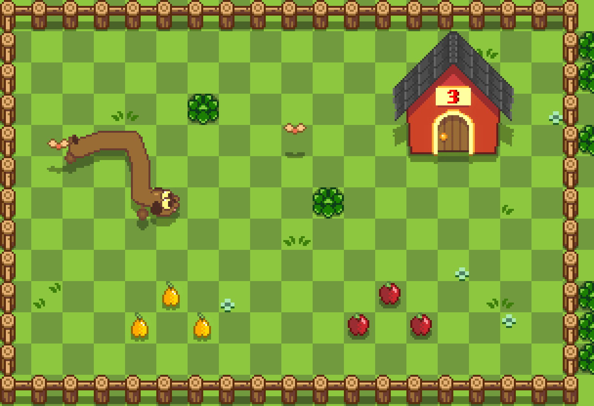
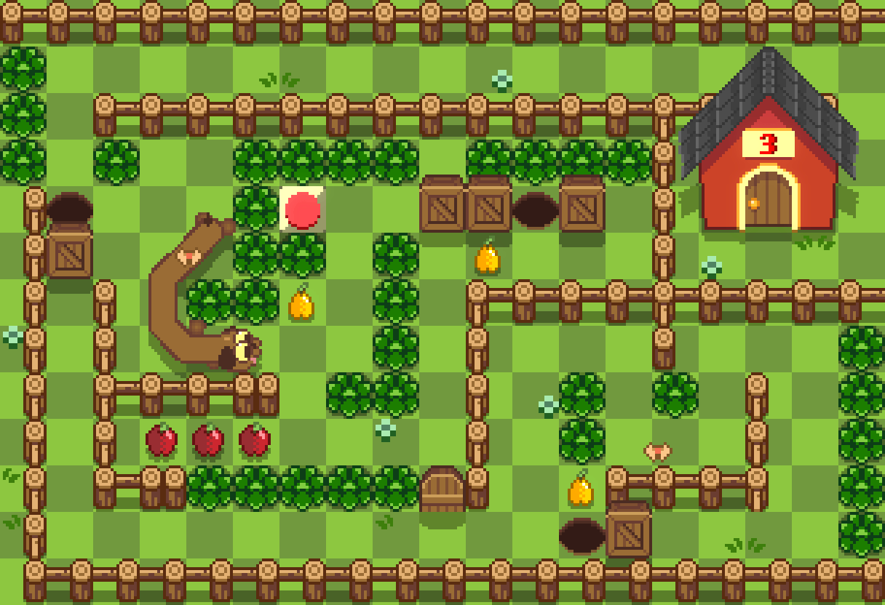
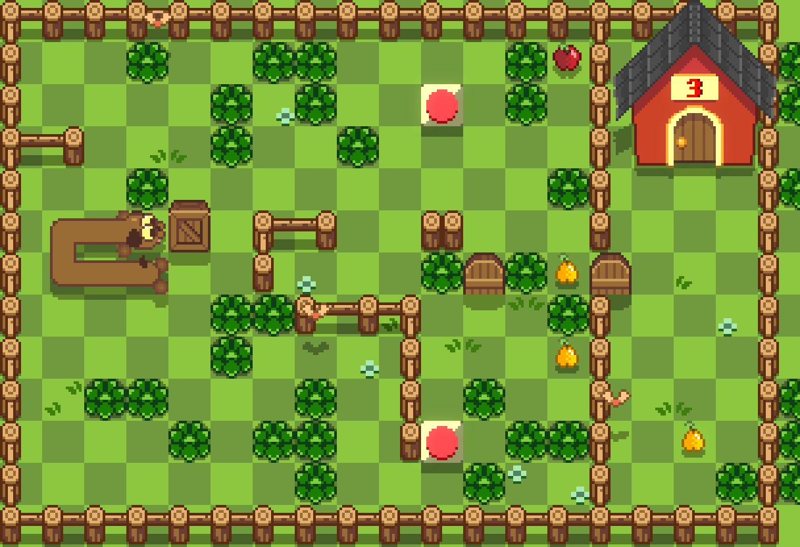

# Longo Doggo

A C99 + raylib build of [Longo Doggo](https://romeuski.itch.io/longo-doggo),
ported from the original GameMaker project. CMake drives native and
Emscripten targets from one codebase.

<p align="center">
  
  
  
</p>

The game logic is a plain-C tile-based simulation, organised as one
script per object.

## Architecture

```
src/core/     world.c     room load, the explicit tick order, draw order
              solid.c     shared occupancy/solidity feature
              undo.c      move history: verbatim board snapshots
              events.c    sound + visual-effect queues
              view.c      draw-item kernel, animation clocks
              sprites.*   sprite asset metadata
              level_data.*  room tables (source of truth)
src/objects/  dog.c box.c hole.c door.c button.c items.c house.c
              fx.c butterfly.c flower.c dialogue.c transition.c title.c
src/render.c  raylib backend: assets, surfaces, replay
              (UI text is Renogare at window scale; the house counter
              keeps the pixel digits font)
src/main.c    platform glue: window, input, audio
```

Each object script owns its state (module-local), its rules, and its
drawing; cross-object interactions are plain function calls (the dog
asks `box_push()`, buttons consult `solid_presses_button()`). The
`core/solid` feature maps cells to occupants so walls, holes, doors,
boxes and the dog's body share one collision vocabulary. `world.c` holds
the entire tick order in one readable function.

The simulation is fully tile-based: the dog's head snaps between 16px
cells and the body chain shifts along like a snake. Movement steps one
cell per key *press*, with a two-tick `key_cooldown` gating mashed
repeats. Each object script also owns its view: sprite positions are
born on the snapped cell at placement and ease toward it on movement,
so motion snaps logically and stays smooth on screen. Push/jam rules,
hole fills, button/door counting, apple/pear length changes, the house
counter and win sequencing are all verified by headless tests.

`docs/architecture.md` expands on how the layers fit together and the
design rules the simulation follows (footprint-to-cell stamping, the
view angle conventions, sprite identity from the object table, and
which presentation choices are deliberate substitutions — window-scale
text, the 9-slice dialogue panel, the dropped ground tile layer).

## Build and run on Windows

From PowerShell:

```powershell
cmake -S . -B build -G Ninja -DLONGO_DOGGO_PLATFORM=native
cmake --build build --parallel
ctest --test-dir build --output-on-failure
.\build\longo_doggo.exe
```

The build copies the runtime assets to `build/assets/exported-assets/`.
Controls: arrow keys or WASD step one cell per press, `Z` (or stepping
backwards, into the dog's own neck) undoes the last step, `R` retries
the room, Space barks, Enter/E/Space advance dialogues, any key starts
from the title.

`tests/game_smoke.c` exercises the simulation headlessly: title →
tutorial flow, dialogue gating, movement cadence, chain follow,
apple/pear length changes, box push and hole fill, simultaneous
button/door logic, the win transition order, retry, and undo.

## Web export

Install and activate the Emscripten SDK, then run:

```powershell
emcmake cmake -S . -B build/web -DLONGO_DOGGO_PLATFORM=web -DCMAKE_BUILD_TYPE=Release
cmake --build build/web --parallel
```

This emits `longo_doggo.html` together with its `.js`, `.wasm`, and `.data`
files in `build/web` — the runtime assets are packed into `longo_doggo.data`
and load through the Emscripten virtual filesystem. Serve that directory over
HTTP for browser testing. See
[`docs/build.md`](docs/build.md) for the expanded platform notes.
